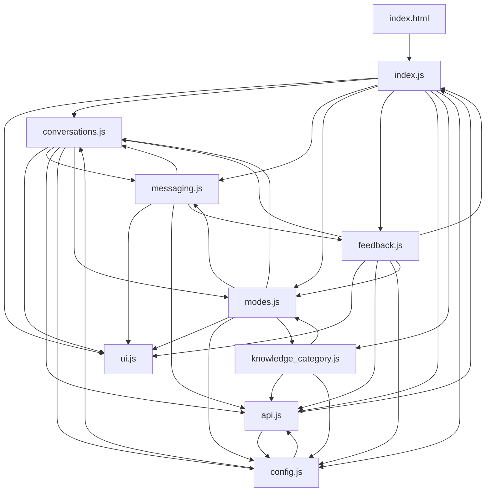
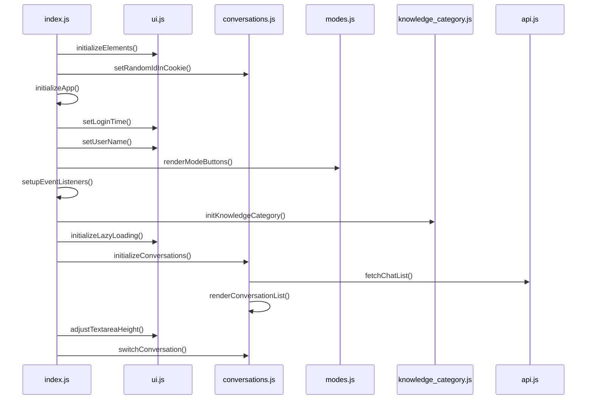
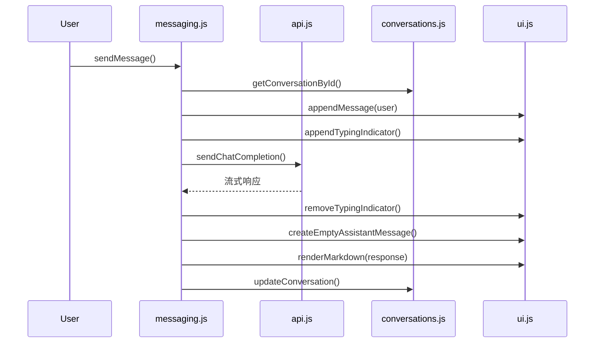
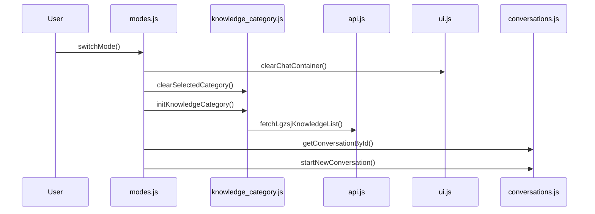
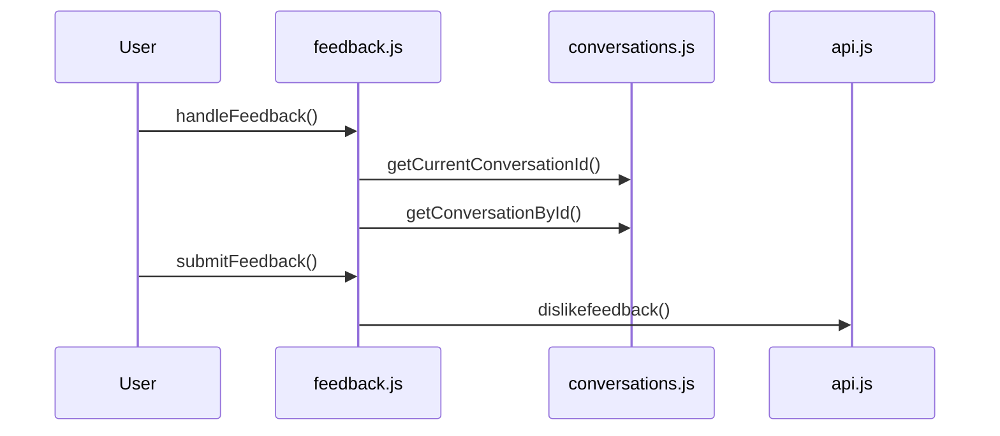
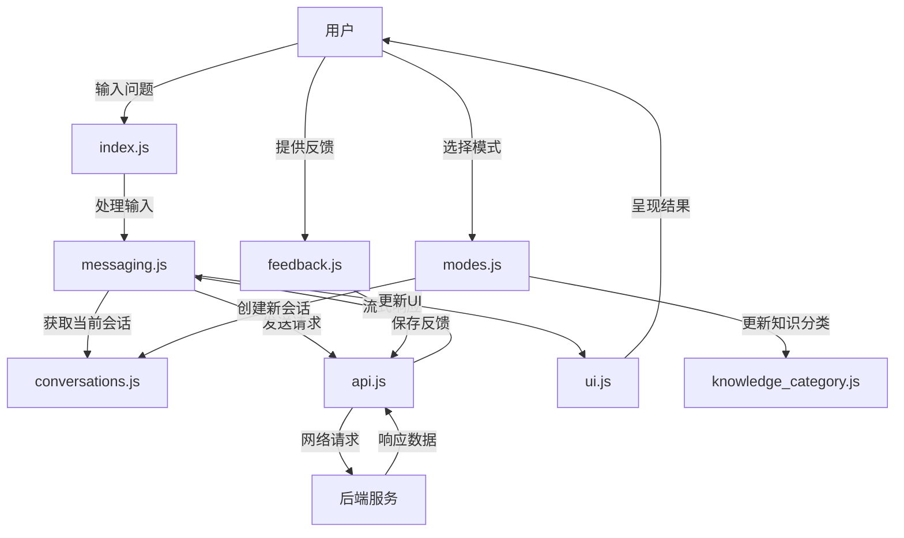

# 政数局智能助手项目架构文档

## 项目整体架构概览

该项目是一个基于Web的知识库智能助手系统，主要提供针对不同业务领域（市监局、医保中心、政务中心）的智能问答服务。系统采用前端单页应用设计，通过JavaScript模块化架构实现各功能模块的解耦与组织。

## 代码文件依赖关系

### 核心依赖关系

- **index.js**: 应用入口，负责初始化各模块和事件监听
  - 依赖: ui.js, messaging.js, conversations.js, modes.js, feedback.js, config.js, api.js, knowledge_category.js
  
- **config.js**: 配置中心，存储API地址、模型类型、各业务领域设置
  - 依赖: conversations.js, api.js
  - 被依赖: 几乎所有其他模块

- **api.js**: API接口封装，处理与后端通信
  - 依赖: config.js, index.js
  - 被依赖: conversations.js, messaging.js, knowledge_category.js, feedback.js

- **ui.js**: 用户界面操作，DOM元素管理，渲染处理
  - 依赖: config.js, feedback.js
  - 被依赖: index.js, messaging.js, conversations.js, modes.js

### 依赖关系矩阵

| 模块               | 依赖的模块                                                |
|-------------------|----------------------------------------------------------|
| index.js          | ui.js, messaging.js, conversations.js, modes.js, feedback.js, config.js, api.js, knowledge_category.js |
| config.js         | conversations.js, api.js                                  |
| api.js            | config.js, index.js                                       |
| ui.js             | config.js, feedback.js                                    |
| conversations.js  | ui.js, messaging.js, api.js, config.js, modes.js          |
| messaging.js      | ui.js, api.js, conversations.js, feedback.js              |
| modes.js          | ui.js, config.js, conversations.js, messaging.js, knowledge_category.js |
| feedback.js       | ui.js, conversations.js, api.js, config.js, modes.js, index.js |
| knowledge_category.js | api.js, config.js, modes.js                          |

## 功能模块调用逻辑

### 初始化流程

### 聊天消息处理流程

### 知识分类与模式切换

### 反馈处理流程

## 关键代码文件定位索引

### 核心文件

| 文件名 | 主要功能 | 关键函数/方法 |
|--------|---------|--------------|
| index.js | 应用入口，初始化、事件监听 | initializeApp(), setupEventListeners() |
| api.js | API通信层 | sendChatCompletion(), fetchKnowledgeCategory(), generateId() |
| config.js | 配置管理 | API_BASE_URL, modeConfig对象 |
| ui.js | UI渲染与交互 | renderMarkdown(), appendMessage(), adjustTextareaHeight() |

### 业务功能文件

| 文件名 | 主要功能 | 关键函数/方法 |
|--------|---------|--------------|
| conversations.js | 会话管理 | initializeConversations(), switchConversation(), startNewConversation() |
| messaging.js | 消息处理 | sendMessage(), appendMessage(), updateMessageContent() |
| modes.js | 模式管理 | switchMode(), getCurrentMode(), renderModeButtons() |
| knowledge_category.js | 知识分类 | initKnowledgeCategory(), selectCategory(), clearSelectedCategory() |
| feedback.js | 反馈处理 | handleFeedback(), submitFeedback() |

## 技术栈与外部依赖

- **前端框架**: 原生JavaScript + Tailwind CSS
- **UI组件**: 使用原生HTML + CSS + JS
- **外部库**:
  - marked.min.js: Markdown渲染
  - purify.min.js: 防XSS攻击
  - sweetalert2.js: 优化的提示框
  - axios.min.js: HTTP请求处理

## 功能模块详解

### 1. 会话管理 (conversations.js)
负责管理用户会话，包括创建新会话、切换会话、保存会话历史等。
核心数据结构: conversations数组，存储所有会话。

### 2. 消息处理 (messaging.js)
处理消息的发送、接收、渲染等功能，实现流式响应和Markdown渲染。

### 3. 模式管理 (modes.js)
管理不同的功能模式，如市监局、医保中心、政务中心，包括模式切换和对应UI更新。

### 4. 知识分类 (knowledge_category.js)
管理知识分类树，提供分类选择、清除等功能，用于精确定位知识库查询范围。

### 5. 反馈处理 (feedback.js)
处理用户对AI回答的反馈，包括点赞和踩，记录反馈类型和详细信息。

### 6. API通信 (api.js)
封装所有与后端API的通信，包括获取知识分类、发送聊天请求、获取会话历史等。

### 7. UI管理 (ui.js)
处理DOM元素的创建、更新、渲染等，实现界面交互效果。

### 8. 配置管理 (config.js)
集中管理系统配置，包括API地址、模型选择、各模式的配置信息等。

## 数据流转架构

该智能助手系统通过模块化设计实现了灵活的功能扩展和维护，各模块间职责明确，相互配合形成完整的用户交互流程。
